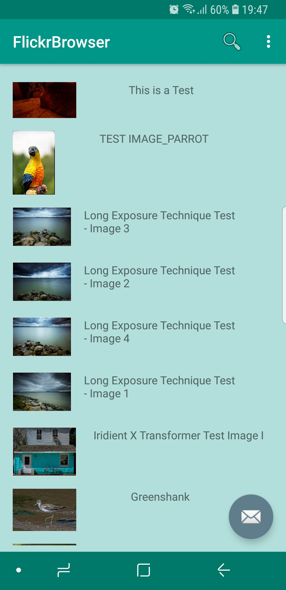

# FlickrBrowser

This is a simple Android app that makes use of the [Flickr API](https://www.flickr.com/services/feeds). 

The app pulls JSON data from the Flickr API after sarch terms is entered. The data is then parsed and displayed in a RecyclerView.

This app mainly coded using the tutorial from the Udemy Class: Android Java Masterclass - Become an App Developer.

  
